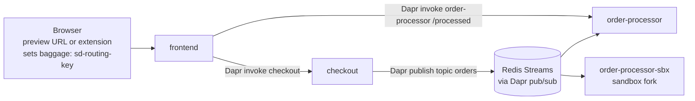

# Testing Dapr Microservices with Signadot Sandboxes

> **Status: bootstrap draft.** The code and manifests here are a starting point.
> Items marked 🔍 still need to be verified end to end on a real cluster; see
> [GUIDE.md](GUIDE.md) for the research and verification plan.

[Dapr](https://docs.dapr.io/) gives microservices a sidecar that handles
service-to-service calls and pub/sub messaging. [Signadot](https://www.signadot.com/docs/overview)
lets you test a changed service inside a shared Kubernetes cluster by forking
only that service into a *sandbox* and routing selected requests to it, using a
*routing key* carried in request headers.

This tutorial shows how the two work together for the two things Dapr apps do most:

1. **Service invocation** (synchronous): a request carrying a sandbox routing key
   reaches the sandboxed `checkout` instead of the baseline one.
2. **Pub/sub** (asynchronous): a message published on behalf of that request is
   processed by the sandboxed `order-processor` and skipped by the baseline, and
   vice versa for ordinary traffic.

## The application



| Service | Dapr app-id | Role |
|---|---|---|
| `frontend` | `frontend` | Web UI. Forwards the routing headers on every Dapr call it makes. |
| `checkout` | `checkout` | Receives orders via service invocation, publishes `order.created`. |
| `order-processor` | `order-processor` | Subscribes to `orders`, decides per message whether to act. |
| `redis` | | Broker behind the Dapr `pubsub` component. |

Every service is ordinary Dapr code. Everything Signadot-specific lives in
[`app/signadot/`](app/signadot/): about 100 lines that extract the routing key and
query the Signadot Routes API.

## How it works

### One rule above all: a sandbox fork gets its own Dapr app-id ✅

Dapr's operator creates a Service named `<app-id>-dapr` for every Dapr-enabled
Deployment, with the Deployment's `matchLabels` as selector. If a second
Deployment in the namespace uses the same app-id, the operator *overwrites*
that Service to point at whichever Deployment it reconciled last. A Signadot
fork with the baseline's app-id would hijack the baseline's Dapr Service and,
when the sandbox is deleted, garbage-collect it.

So every sandbox spec in [`signadot/`](signadot/) patches the pod-template
annotation to a unique app-id (`checkout-sbx`, `order-processor-sbx`). That one
line has several consequences, listed under [Gotchas](#gotchas-things-keyed-by-app-id).

### Use case 1: service invocation ✅ design, 🔍 end-to-end

Dapr normally sends `invoke/checkout` from the caller's sidecar to the callee's
sidecar over gRPC (port 50002, mTLS). On that hop the routing key is *inside the
protobuf body*, not in gRPC metadata, so neither Signadot DevMesh nor Istio can
route on it. We verified this in Dapr's source; see GUIDE.md.

The fix is configuration only: [`k8s/dapr/httpendpoints.yaml`](k8s/dapr/httpendpoints.yaml)
declares a Dapr `HTTPEndpoint` with the *same name* as the app-id and the app's
Kubernetes Service as `baseUrl`. Dapr resolves HTTPEndpoint names before
app-ids, so callers keep calling `invoke/checkout` unchanged, but the caller's
sidecar now sends a plain HTTP request through the `checkout` Service. That
request carries the `baggage` header and lands on the baseline pod, where the
Signadot DevMesh sidecar (`sidecar.signadot.com/inject: "true"`) routes it to
the fork when the key matches.

Trade-off: the callee's own sidecar is bypassed for inbound invocations, so
Dapr mTLS and access-control do not apply on that hop. The callee still uses
its sidecar for everything outbound. Alternatives are discussed in GUIDE.md.

### Use case 2: pub/sub ✅ design, 🔍 end-to-end

Same shape as the [Kafka](../selective-consumption-with-kafka) and
[Temporal](../temporal-tutorial) examples:

- Each Dapr app-id is its own consumer group, so the baseline and the fork
  both receive every message. No broker changes.
- `checkout` copies the inbound `baggage` header into the message as a
  CloudEvents extension attribute, so the routing key rides inside the message
  on any broker.
- `order-processor` polls the Signadot Routes API and applies the standard rule:
  a sandbox processes only keys that route to it; the baseline processes
  everything except keys claimed by one of its sandboxes. Messages it should
  not act on are acknowledged and skipped.
- The subscription is programmatic (`GET /dapr/subscribe`), so the fork
  subscribes automatically under its new app-id.

## Prerequisites

- A Kubernetes cluster. The commands below assume minikube (`minikube start --cpus 4 --memory 6g`).
- [Dapr CLI](https://docs.dapr.io/getting-started/install-dapr-cli/) and Dapr installed in the cluster: `dapr init -k --wait` ([docs](https://docs.dapr.io/operations/hosting/kubernetes/kubernetes-deploy/)).
- [Signadot Operator](https://www.signadot.com/docs/installation/signadot-operator) installed with DevMesh (the default), and the [Signadot CLI](https://www.signadot.com/docs/getting-started/installation) authenticated.
- Docker.

## Quick start

Build one image for all three services and deploy the baseline:

```bash
cd examples/dapr-tutorial
docker build -t dapr-signadot-demo:v1.0 app
minikube image load dapr-signadot-demo:v1.0

kubectl apply -f k8s/namespace.yaml
kubectl apply -f k8s/redis.yaml
kubectl apply -f k8s/dapr/pubsub-redis.yaml -f k8s/dapr/httpendpoints.yaml
kubectl apply -f k8s/frontend.yaml -f k8s/checkout.yaml -f k8s/order-processor.yaml
kubectl -n dapr-demo get pods -w
```

Expected: `checkout` and `order-processor` show `3/3` containers (app, `daprd`,
`sd-sidecar`), `frontend` shows `2/2`, `redis` `1/1`.

Try the baseline without any routing key:

```bash
kubectl -n dapr-demo port-forward svc/frontend 8080:8080
```

Open http://localhost:8080, place an order. `handled_by.app_id` is `checkout`
and the processed table shows `processed_by: order-processor`.

Create the sandboxes and a route group that combines them:

```bash
signadot sandbox apply -f signadot/sandbox-checkout.yaml --set cluster=<your-cluster-name>
signadot sandbox apply -f signadot/sandbox-order-processor.yaml --set cluster=<your-cluster-name>
signadot routegroup apply -f signadot/routegroup.yaml --set cluster=<your-cluster-name>
```

Each command prints a preview URL for the frontend. Open one and place an order:

| Opened through | `handled_by.app_id` | `processed_by` |
|---|---|---|
| plain port-forward (no key) | `checkout` | `order-processor` |
| `dapr-checkout-sbx` preview URL | `checkout-sbx` | `order-processor` |
| `dapr-order-processor-sbx` preview URL | `checkout` | `order-processor-sbx` |
| `dapr-demo` route group URL | `checkout-sbx` | `order-processor-sbx` |

Watch both consumers decide, one processing and the other skipping each message:

```bash
kubectl -n dapr-demo logs deploy/order-processor -c order-processor -f
kubectl -n dapr-demo logs -l signadot.com/sandbox-name=dapr-order-processor-sbx -c order-processor -f
```

🔍 The label selector used for the fork's pods is a guess; confirm with `kubectl -n dapr-demo get pods --show-labels`.

Clean up:

```bash
signadot routegroup delete dapr-demo
signadot sandbox delete dapr-checkout-sbx
signadot sandbox delete dapr-order-processor-sbx
kubectl delete namespace dapr-demo
```

## Gotchas: things keyed by app-id

Because the fork runs under a new app-id, anything Dapr keys by app-id behaves
differently for it:

| Dapr feature | Effect on the fork | What to do |
|---|---|---|
| `<app-id>-dapr` Service | A separate Service is created for the fork. Harmless. | Nothing. Never reuse the baseline app-id. |
| Pub/sub consumer group | Fork gets its own group and receives all messages. | Selective consumption (this tutorial). |
| Declarative `Subscription` with `scopes` | Not applied to the fork's app-id. | Use programmatic or streaming subscriptions, or add the fork's app-id to `scopes`. |
| Component `scopes` | Fork cannot use a component scoped to the baseline app-id. | Leave shared components unscoped or include the fork. |
| State store `keyPrefix: appid` (default) | Fork reads and writes its own key space. | Fine for isolation; set `keyPrefix: name` to share state. |
| Access control policies | Policies naming the baseline app-id do not cover the fork. | Add the fork or use namespace-level rules. |

## Variations

- **Kafka instead of Redis**: [`k8s/dapr/pubsub-kafka.yaml`](k8s/dapr/pubsub-kafka.yaml)
  has the steps. With Kafka, record headers reach the subscriber as HTTP
  headers, so `?metadata.baggage=...` on publish is an alternative to the
  CloudEvent attribute.
- **`tracestate` instead of a CloudEvent attribute** 🔍: when Dapr tracing is
  enabled, Dapr copies the publisher's `tracestate` into the CloudEvent, and
  Signadot accepts `tracestate: sd-routing-key=...`. This avoids touching the
  message at all but depends on tracing configuration and on `traceparent`
  being present. `routing_key_from_event` already falls back to it.

## Limitations and roadmap

- Routing the native sidecar-to-sidecar gRPC hop would need Dapr to put
  `baggage` into the gRPC metadata of its internal call. That is a small
  upstream change; until then, HTTPEndpoint is the configuration-only path.
- No local-sandbox (`signadot local connect`) flow yet: a locally run Dapr
  sidecar would need name resolution into the cluster.

## Repository layout

```
app/
  frontend/, checkout/, order_processor/   ordinary Dapr services (FastAPI)
  signadot/                                platform layer: routing key + Routes API
  common/dapr.py                           thin wrapper over the Dapr HTTP API
k8s/                                       namespace, redis, three Deployments/Services
k8s/dapr/                                  pub/sub component(s), HTTPEndpoints
signadot/                                  two sandbox specs and a route group
GUIDE.md                                   research and verification plan
```
