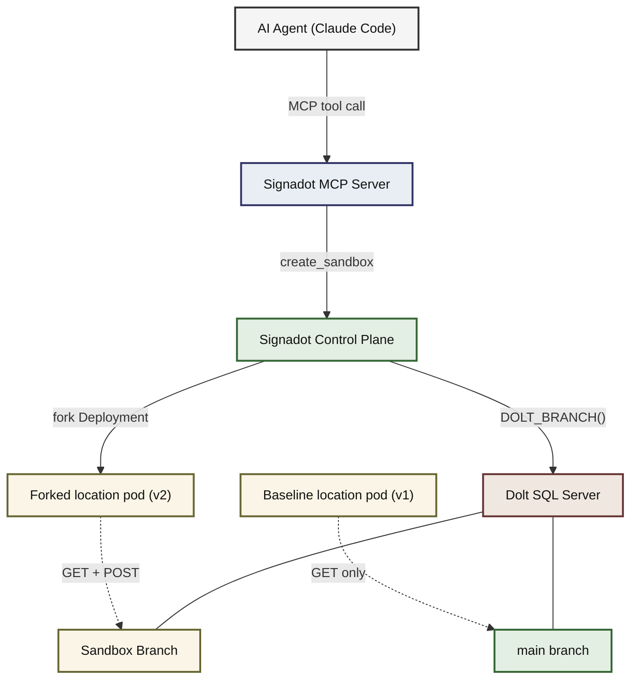
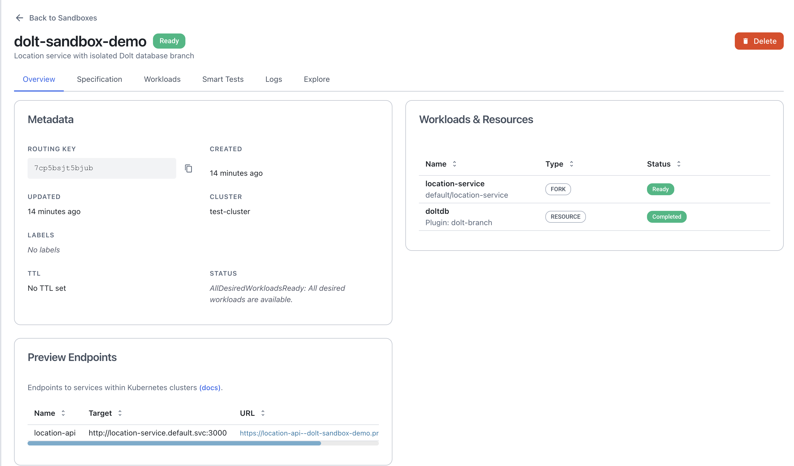
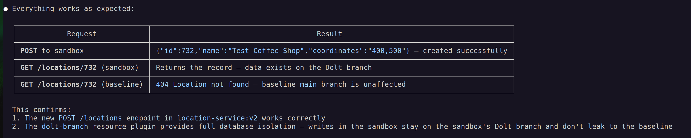

# Building a Closed-Loop Agent Workflow with Signadot MCP and Dolt

## Prerequisites

- A running minikube cluster
- `kubectl` installed and configured for your cluster
- Docker installed (for building the location service image)
- A [Signadot account](https://www.signadot.com/) with the Operator installed in your cluster
- The `signadot` CLI installed ([installation guide](https://docs.signadot.com/docs/reference/cli/overview))
- [Claude Code](https://docs.anthropic.com/en/docs/claude-code/overview) with the [Signadot MCP server](https://docs.signadot.com/docs/integrations/mcp) configured

## Overview

Ephemeral sandbox environments isolate your services, but they still share the same staging database. One developer's test writes corrupt another's query results. [Dolt](https://docs.dolthub.com/) is a MySQL-compatible database with built-in Git-style version control that solves this problem. A [Signadot Resource Plugin](https://docs.signadot.com/docs/reference/resource-plugins) creates a Dolt branch when a sandbox starts and deletes it when the sandbox is removed. Every sandbox reads from its own isolated copy of the data while the baseline stays on `main`.

The [Signadot MCP server](https://docs.signadot.com/docs/integrations/mcp) connects this infrastructure to your editor. An AI agent can create sandboxes, check their status, and test endpoints through native MCP tool calls instead of manual CLI commands. This tutorial uses Claude Code, but other MCP-compatible coding agents should work as well. See the [Signadot MCP integration guide](https://docs.signadot.com/docs/integrations/mcp) for Cursor and VS Code setup.

## What You Will Build

You will deploy a Dolt SQL server, a read-only location service, and a Signadot Resource Plugin that manages Dolt branches. Then you will use an AI agent to add a `POST /locations` endpoint to the service, build a new image, create a sandbox with an isolated Dolt branch, and verify that writes on the sandbox branch do not affect the baseline.

The scenario requires both a forked service to deploy the new code and an isolated database branch to prevent test writes from polluting `main`. Neither one alone is sufficient.


## Setting Up the Integration

### Step 1: Clone the Example Repository

```bash
git clone https://github.com/signadot/examples.git
cd examples/dolt-tutorial
```

```
dolt-tutorial/
├── app/
│   ├── index.js                  # Location service (Express + mysql2)
│   ├── package.json
│   └── Dockerfile
├── k8s/
│   ├── dolt-deployment.yaml      # Dolt SQL server Deployment + PVC
│   ├── dolt-service.yaml         # ClusterIP Service (dolt-db.default.svc:3306)
│   ├── dolt-init-configmap.yaml  # Seed data (locations table)
│   └── location-service.yaml     # Location service Deployment + Service
├── signadot/
│   ├── dolt-branch-plugin.yaml   # Resource Plugin (create/delete branches)
│   └── sandbox.yaml              # Sandbox spec (forks location service)
└── scripts/
    ├── deploy.sh         # Build image + deploy Dolt + location service + plugin
    ├── verify.sh         # Check deployment, branches, sandbox
    └── cleanup.sh        # Tear down everything
```

### Step 2: Connect to the Cluster

Run `signadot local connect` so you can reach in-cluster services directly from your machine:

```bash
signadot local connect --cluster <YOUR_CLUSTER>
```

Enter your local machine's password. You should see:

```
signadot local connect has been started ✓
* runtime config: cluster test-cluster, running with root-daemon
✓ Local connection healthy!
    * operator version 1.3.0
    * devbox 5ef02b01928205c01f377588524a5594 connected
    * port-forward listening at ":50602"
    * localnet has been configured
    * 22 hosts accessible via /etc/hosts
    * sandboxes watcher is running
* Mapped Sandboxes:
    - No active sandbox
```

Keep this running in the background.

### Step 3: Deploy Everything

Point your shell at minikube's Docker daemon so the image builds inside minikube:

```bash
eval $(minikube docker-env)
```

Then run the deploy script:

```bash
./scripts/deploy.sh
```

The script prompts for your Signadot API key if not already authenticated. Generate one from the [Signadot Dashboard](https://app.signadot.com/settings/apikeys) under **Settings > API Keys.**

### The Location Service

The baseline version (v1) exposes `GET /locations`, `GET /locations/:id`, and `GET /health`. There is no write endpoint yet. You will add one in the next section.

The key environment variable is `MYSQL_DBNAME`. The baseline Deployment sets it to `location`, which Dolt resolves to the `main` branch. When a sandbox overrides this variable with `location/branchname`, Dolt routes the connection to that branch instead. See the Dolt docs on [database revision specifiers](https://docs.dolthub.com/sql-reference/version-control/branches) for details.

### The Resource Plugin

The deploy script registers the `dolt-branch` plugin with Signadot. The key part of its `create` script:

```bash
SAFE_NAME=$(echo "${SIGNADOT_SANDBOX_NAME}" | tr -d '-')
BRANCH_NAME="sandbox${SAFE_NAME}"

mysql -h "${DOLT_HOST}" -P "${DOLT_PORT}" \
  -u "${DOLT_USER}" -p"${DOLT_PASSWORD}" "${DOLT_DATABASE}" \
  -e "CALL DOLT_BRANCH('${BRANCH_NAME}', 'main');"

echo -n "${DOLT_DATABASE}/${BRANCH_NAME}" > /outputs/db-name
```

The script strips hyphens from the sandbox name to comply with Dolt's branch naming rules, creates the branch, and writes the branch-qualified database name (e.g. `location/sandboxdoltsandboxdemo`) to an output file. The Signadot Operator passes this value to the forked pod. The plugin's `delete` script calls `DOLT_BRANCH('-D', ...)` to force-delete the branch when the sandbox is removed.

## Developing and Testing a Feature

The baseline location service only supports reads. In this section, the AI agent will add a write endpoint, build a new image, deploy it to an isolated sandbox, and verify that test writes land on the sandbox's Dolt branch without touching `main`. The entire workflow runs through three prompts.

The examples below use [Claude Code](https://docs.anthropic.com/en/docs/claude-code/overview) with the [Signadot MCP server](https://docs.signadot.com/docs/integrations/mcp).

### Prompt 1: Add the POST Endpoint

```
Add a new "POST /locations" endpoint to store new locations
and build a location-service:v2 image.
```

The agent reads `app/index.js`, adds `express.json()` middleware and a `POST /locations` route that inserts a record into the `locations` table, then runs `docker build -t location-service:v2 app/`.

### Prompt 2: Create the Sandbox

```
Create a Signadot sandbox called "dolt-sandbox-demo" on my cluster
"test-cluster" with the image location-service:v2. Use the dolt-branch
resource plugin for database isolation.
```

The agent presents the sandbox configuration for your review and, after you confirm, calls `create_sandbox` through the Signadot MCP server. Signadot runs the Resource Plugin (which creates a new Dolt branch from `main`), forks the location-service Deployment with the `v2` image, and points the forked pod's `MYSQL_DBNAME` at the new branch.

Two pods are now running: the baseline (v1, reading from `main`) and the fork (v2, reading from and writing to the sandbox branch).

The routing key tells Signadot which requests should go to the forked pod:



### Prompt 3: Test the Change

```
You are already connected to the cluster (signadot local connect), so you
can access cluster services directly. Access the sandbox to test the new
POST endpoint. Create a location called "Test Coffee Shop" with coordinates
"400,500". Then verify the new record exists in the sandbox but not in
the baseline.
```

The agent calls `get_sandbox` to retrieve the routing key, POSTs a new record to the sandbox, reads it back to confirm it was written, then reads the same ID from the baseline to confirm it was not written there. All requests hit the same URL. The `baggage: sd-routing-key` header is the only difference. Signadot routes requests with the header to the forked pod, and requests without it go to the baseline.



You can run the same test manually. First, extract the routing key:

```bash
export ROUTING_KEY=$(signadot sandbox get dolt-sandbox-demo -o json | jq -r .routingKey)
```

POST a record to the sandbox:

```bash
curl -s -X POST \
  -H "baggage: sd-routing-key=$ROUTING_KEY" \
  -H "Content-Type: application/json" \
  -d '{"name":"Test Coffee Shop","coordinates":"400,500"}' \
  http://location-service.default.svc:3000/locations
```

Read it back from the sandbox:

```bash
curl -s -H "baggage: sd-routing-key=$ROUTING_KEY" \
  http://location-service.default.svc:3000/locations/732
# {"id":732,"name":"Test Coffee Shop","coordinates":"400,500"}
```

Read the same ID from the baseline:

```bash
curl -s http://location-service.default.svc:3000/locations/732
# {"error":"Location not found"}
```

### Iterate

The agent retains full context within the conversation. If you need to test additional edge cases like duplicate names, missing fields, or concurrent writes, the agent can make requests and inspect results without you re-explaining the setup.

### Teardown

Delete the sandbox through the CLI:

```bash
signadot sandbox delete dolt-sandbox-demo
```

The Resource Plugin's `delete` workflow runs automatically and drops the sandbox branch from Dolt. The Signadot MCP server does not expose delete operations to prevent accidental sandbox removal during a conversation.

## Managing Sandboxes Without the Agent

If you prefer the CLI or need to script sandbox operations in CI, the following commands cover the full lifecycle. All commands assume `signadot local connect` is running.

### The Sandbox Specification

The sandbox spec in `signadot/sandbox.yaml` declares a dependency on the `dolt-branch` plugin and forks the location service with an overridden image and `MYSQL_DBNAME`:

```yaml
resources:
  - name: doltdb
    plugin: dolt-branch

forks:
  - forkOf:
      kind: Deployment
      namespace: default
      name: location-service
    customizations:
      images:
        - image: "@{image}"
      env:
        - name: MYSQL_DBNAME
          container: location
          valueFrom:
            resource:
              name: doltdb
              outputKey: createbranch.db-name

defaultRouteGroup:
  endpoints:
    - name: location-api
      target: "http://location-service.default.svc:3000"
```

The `@{image}` placeholder resolves at apply time via `--set image=location-service:v2`. The `MYSQL_DBNAME` value comes from the Resource Plugin's output.

### CLI Lifecycle

Create a sandbox:

```bash
signadot sandbox apply -f signadot/sandbox.yaml \
  --set cluster=<YOUR_CLUSTER> --set image=location-service:v2
```

Check sandbox status and get the routing key:

```bash
export ROUTING_KEY=$(signadot sandbox get dolt-sandbox-demo -o json | jq -r .routingKey)
```

Query the sandbox endpoint:

```bash
curl -H "baggage: sd-routing-key=$ROUTING_KEY" \
  http://location-service.default.svc:3000/locations
```

Verify the Dolt branch was created:

```bash
kubectl exec deploy/dolt-db -c dolt -- \
  bash -c "cd /var/lib/dolt/location && dolt sql -q 'SELECT * FROM dolt_branches;'"
```

Delete the sandbox:

```bash
signadot sandbox delete dolt-sandbox-demo
```

Tear down everything, including the Dolt server, location service, PVC, Secret, and Resource Plugin:

```bash
./scripts/cleanup.sh
```

## Conclusion

Each Signadot sandbox gets its own forked microservice pod and its own Dolt database branch. The Resource Plugin handles the full branch lifecycle, and the MCP integration lets the AI agent manage the entire development workflow from your editor: writing code, building images, provisioning sandboxes, and testing in isolation.

All manifests, scripts, and specs from this tutorial are available in the [Dolt tutorial repository](https://github.com/signadot/examples).
