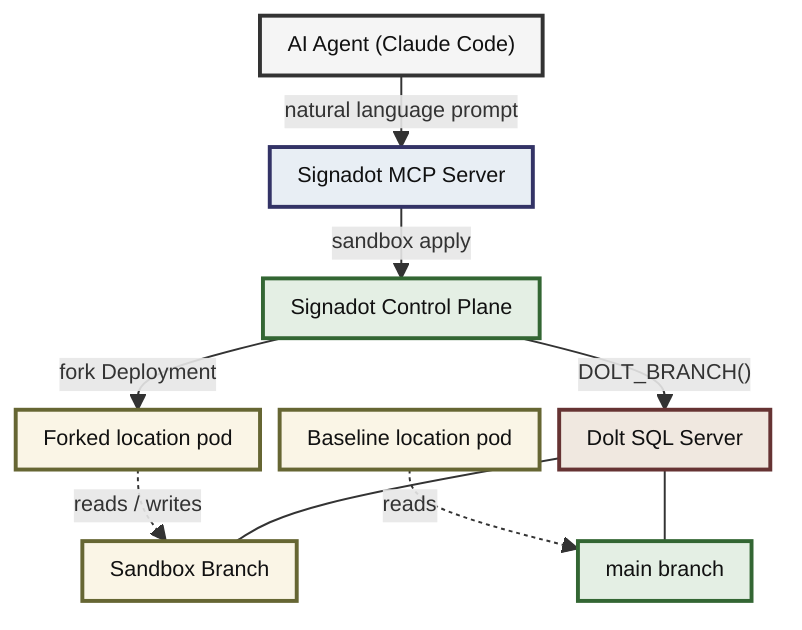

# Building a Closed-Loop Agent Workflow with Signadot MCP and Dolt

## Prerequisites

- A running minikube cluster
- `kubectl` installed and configured for your cluster
- Docker installed (for building the location service image)
- A [Signadot account](https://www.signadot.com/) with the Operator installed in your cluster
- The `signadot` CLI installed ([installation guide](https://docs.signadot.com/docs/reference/cli/overview))
- [Claude Code](https://docs.anthropic.com/en/docs/claude-code/overview) with the [Signadot MCP server](https://docs.signadot.com/docs/integrations/mcp) configured

## Overview

Ephemeral sandbox environments isolate your services, but they still share the same staging database. One developer's test writes corrupt another's query results. [Dolt](https://docs.dolthub.com/), a MySQL-compatible database with built-in Git-style version control, solves this. A [Signadot Resource Plugin](https://docs.signadot.com/docs/reference/resource-plugins) creates a Dolt branch when a sandbox starts and deletes it when the sandbox is removed, so every sandbox reads from its own isolated copy of the data while the baseline stays on `main`.

The [Signadot MCP server](https://docs.signadot.com/docs/integrations/mcp) connects this infrastructure to your editor. This tutorial walks through the one-time setup (deploying Dolt, a custom location service, and the Resource Plugin), then demonstrates an agent-driven workflow where Claude Code creates sandboxes, tests against isolated data, and iterates on a bug fix. The tutorial uses Claude Code, but any MCP-compatible client works. See the [Signadot MCP integration guide](https://docs.signadot.com/docs/integrations/mcp) for Cursor and VS Code setup.

## What You Will Build

The end-to-end system works as follows:

1. You deploy a Dolt SQL server in Kubernetes and seed it with location data.
2. You deploy a custom location service that reads from Dolt's `main` branch.
3. You install a Signadot Resource Plugin that creates and deletes Dolt branches.
4. You connect the Signadot MCP server to Claude Code.

From that point on, the agent handles most of the workflow. It creates a sandbox (which triggers a Dolt branch), tests against the isolated endpoint, and iterates on the code. When you are done, you delete the sandbox through the CLI.



The agent operates against its own forked service and its own database branch. The baseline pod continues reading from `main`. No other developer's writes interfere, and no leftover test records from a previous iteration pollute the results.

## How It Works

### Dolt Database Branching

Dolt stores every table as a [Prolly Tree](https://docs.dolthub.com/architecture/storage-engine/prolly-tree) (Probabilistic B-tree), a content-addressed data structure that provides B-tree read performance with built-in structural sharing across versions. Creating a branch is a pointer operation. The new branch references the same underlying data as its parent, and only modified rows consume additional storage.

A single Dolt server can scale to any number of concurrent branches. Clients connect to a specific branch using a [database revision specifier](https://docs.dolthub.com/sql-reference/version-control/branches) in the database name. The format is `database/branch`. For example, `location/my-feature` connects to the `my-feature` branch of the `location` database. A plain database name with no specifier (just `location`) connects to the default branch, which is `main`.

The `mysql2` Node.js driver (used in our location service) passes the database name directly to Dolt as a config field, not inside a DSN string. The value `location/sandboxname` reaches Dolt as-is, and Dolt routes the session to the correct branch. The baseline pods connect with a plain database name (`location`), so they stay on `main`.

You manage branches entirely through SQL:

```sql
-- Create a branch from main
CALL DOLT_BRANCH('my-feature', 'main');

-- Connect to the branch
USE `location/my-feature`;

-- Force-delete the branch when done (use -D because the branch may have unmerged commits)
CALL DOLT_BRANCH('-D', 'my-feature');
```

Both `DOLT_BRANCH()` and `DOLT_CHECKOUT('-b', ...)` can create branches. `DOLT_BRANCH()` creates a branch without switching the current session. `DOLT_CHECKOUT('-b', ...)` creates the branch and switches the session to it. In a multi-session SQL server, `DOLT_CHECKOUT()` only affects the session that calls it. Other connections remain on their current branch. Either procedure is safe for branch creation. See the [Dolt stored procedures reference](https://docs.dolthub.com/sql-reference/version-control/dolt-sql-procedures) for details.

### Signadot Resource Plugins

[Resource Plugins](https://docs.signadot.com/docs/reference/resource-plugins) extend the sandbox lifecycle with custom provisioning logic. A Resource Plugin defines two workflows:

- **create:** Runs before sandboxed workloads start. It provisions an external resource (in our case, a Dolt branch) and writes outputs to files. The Signadot Operator reads those files and makes the values available to sandbox workloads.
- **delete:** Runs after sandboxed workloads terminate. It tears down the resource.

Each workflow executes inside a runner pod in the cluster. Outputs from the `create` workflow flow into sandbox workloads through the `valueFrom.resource` syntax, with no intermediate Kubernetes Secret or ConfigMap required.

### Signadot MCP Server

The [Signadot MCP server](https://docs.signadot.com/docs/integrations/mcp) exposes Signadot's sandbox and route group management as tools that any MCP-compatible AI agent can call. When you connect it to your editor, the agent can create sandboxes, check their status, and query endpoints through natural language. The MCP server does not expose delete operations. Signadot intentionally omits destructive actions from the MCP interface to prevent unintended sandbox removals by an agent. You delete sandboxes through the CLI or the [Signadot Dashboard](https://app.signadot.com/).

Combined with the Resource Plugin, you get a closed loop for development. The agent asks for a sandbox, the plugin provisions the Dolt branch, the agent runs tests against the isolated endpoint, inspects results, adjusts the code, and repeats. When the work is done, you tear down the sandbox through the CLI.

## Setting Up the Integration

The steps in this section are a one-time setup. Once complete, you will use the agent-driven workflow (covered in the next section) as the primary way to interact with sandboxes.

### Step 1: Clone the Example Repository

```bash
git clone https://github.com/signadot/examples.git
cd dolt-tutorial
```

The repository contains the location service source, Kubernetes manifests, the Resource Plugin specification, the sandbox spec, and helper scripts:

```
dolt-tutorial/
├── app/
│   ├── index.js                  # Location service (Express + mysql2)
│   ├── package.json
│   └── Dockerfile
├── k8s/
│   ├── dolt-deployment.yaml      # Dolt SQL server Deployment + PVC
│   ├── dolt-service.yaml         # ClusterIP Service (dolt-db.default.svc:3306)
│   ├── dolt-init-configmap.yaml  # Seed data (locations table)
│   └── location-service.yaml     # Location service Deployment + Service
├── signadot/
│   ├── dolt-branch-plugin.yaml   # Resource Plugin (create/delete branches)
│   └── sandbox.yaml              # Sandbox spec (forks location service)
└── scripts/
    ├── deploy.sh         # Build image + deploy Dolt + location service + plugin
    ├── verify.sh         # Check deployment, branches, sandbox
    └── cleanup.sh        # Tear down everything
```

### Step 2: Connect to the Cluster

Run `signadot local connect` to establish a local connection to your cluster. The command configures networking so that you can reach in-cluster services (like `location-service.default.svc:3000`) directly from your local machine:

```bash
signadot local connect --cluster <YOUR_CLUSTER>
```

Enter your local machine's password. You should see output confirming a healthy connection:

```
signadot local connect needs root privileges for:
	- updating /etc/hosts with cluster service names
	- configuring networking to direct local traffic to the cluster
Password:

signadot local connect has been started ✓
* runtime config: cluster test-cluster, running with root-daemon
✓ Local connection healthy!
    * operator version 1.3.0
    * devbox 5ef02b01928205c01f377588524a5594 connected
    * port-forward listening at ":57149"
    * localnet has been configured
    * 22 hosts accessible via /etc/hosts
    * sandboxes watcher is running
* Mapped Sandboxes:
    - No active sandbox
```

Keep this running in the background. The agent and all `curl` commands in this tutorial rely on it to route requests to baseline and sandboxed services.

### Step 3: Deploy Everything

The deploy script builds the location service Docker image locally, so the image must be available to the cluster's container runtime. Point your shell at minikube's Docker daemon before running the script:

```bash
eval $(minikube docker-env)
```

Then run the deploy script:

```bash
chmod +x scripts/*.sh
./scripts/deploy.sh
```

If the Signadot CLI is not yet authenticated, the script prompts for your API key. You can generate one from the [Signadot Dashboard](https://app.signadot.com/settings/apikeys) under **Settings > API Keys**. If the CLI is already authenticated, it skips ahead to the Dolt password prompt:

```
./scripts/deploy.sh

=== Step 1: Authenticate Signadot CLI ===
Signadot CLI is already authenticated.

=== Step 2: Create Dolt credentials Secret ===
Enter a password for the Dolt root user: 
secret/dolt-credentials created
Secret 'dolt-credentials' created.

=== Step 3: Build the location service image ===
Image 'location-service:latest' built.

=== Step 4: Deploy Dolt SQL server ===
configmap/dolt-init-data created
persistentvolumeclaim/dolt-data created
deployment.apps/dolt-db created
service/dolt-db created

=== Step 5: Wait for Dolt pod to be ready ===
Waiting for deployment "dolt-db" rollout to finish: 0 of 1 updated replicas are available...
deployment "dolt-db" successfully rolled out

=== Step 6: Verify Dolt seed data ===
Dolt pod: dolt-db-85778f5bd4-lqhkq
+-----+-------------------------+-------------+
| id  | name                    | coordinates |
+-----+-------------------------+-------------+
| 1   | My Home                 | 231,773     |
| 123 | Rachel's Floral Designs | 115,277     |
| 392 | Trom Chocolatier        | 577,322     |
| 567 | Amazing Coffee Roasters | 211,653     |
| 731 | Japanese Desserts       | 728,326     |
+-----+-------------------------+-------------+

=== Step 7: Deploy location service ===
deployment.apps/location-service created
service/location-service created

=== Step 8: Wait for location service ===
Waiting for deployment "location-service" rollout to finish: 0 of 1 updated replicas are available...
deployment "location-service" successfully rolled out

=== Step 9: Apply Signadot Resource Plugin ===
Created resource plugin with name "dolt-branch"

=== Deployment complete ===
Create sandboxes with:
  signadot sandbox apply -f signadot/sandbox.yaml --set cluster=<YOUR_CLUSTER>
```

The following sections explain what the script sets up and why each piece matters.

### The Location Service

The `app/` directory contains a minimal Express application backed by Dolt through the `mysql2` driver. It exposes three endpoints:

- `GET /locations` returns all locations.
- `GET /locations/:id` returns a single location by ID.
- `GET /health` checks the database connection.

The service reads its database configuration from environment variables. The critical one is `MYSQL_DBNAME`. The baseline Deployment sets it to `location`, which Dolt resolves to the `main` branch. When a sandbox is created, the Resource Plugin overrides this variable with `location/branchname`, and Dolt routes the connection to the sandbox branch.

The `mysql2` driver passes the `database` config field directly to Dolt in the MySQL handshake. Unlike DSN-based drivers, it does not parse or modify the value. The `/` in `location/branchname` reaches Dolt intact, and Dolt recognizes it as a revision specifier.

### The Init Script

The deploy script applies `k8s/dolt-init-configmap.yaml`, which contains the SQL that creates the `location` database, a `locations` table, and five seed records. The schema:

```sql
CREATE TABLE IF NOT EXISTS locations (
    id          BIGINT UNSIGNED NOT NULL AUTO_INCREMENT PRIMARY KEY,
    name        VARCHAR(255) NOT NULL UNIQUE,
    coordinates VARCHAR(255) NOT NULL
);
```

The init SQL also calls `DOLT_ADD('.')` and `DOLT_COMMIT(...)` to commit the seed data on the `main` branch. Without this commit, branches created later would not inherit any data.

### The Resource Plugin

The deploy script applies `signadot/dolt-branch-plugin.yaml`, which registers the `dolt-branch` plugin with Signadot. The full specification is in the [repository](https://github.com/signadot/examples/tree/main/dolt-tutorial). The key section is the `create` step's script:

```bash
SAFE_NAME=$(echo "${SIGNADOT_SANDBOX_NAME}" | tr -d '-')
BRANCH_NAME="sandbox${SAFE_NAME}"

mysql -h "${DOLT_HOST}" -P "${DOLT_PORT}" \
  -u "${DOLT_USER}" -p"${DOLT_PASSWORD}" "${DOLT_DATABASE}" \
  -e "CALL DOLT_BRANCH('${BRANCH_NAME}', 'main');"

DB_NAME_WITH_BRANCH="${DOLT_DATABASE}/${BRANCH_NAME}"

echo -n "${DB_NAME_WITH_BRANCH}" > /outputs/db-name
```

The `SIGNADOT_SANDBOX_NAME` environment variable is injected automatically by the Signadot Operator. The script strips hyphens to comply with Dolt's branch naming rules. For a sandbox named `dolt-sandbox-demo`, the resulting branch is `sandboxdoltsandboxdemo`.

After creating the branch, the script builds the branch-qualified database name and writes it to an output file. The value `location/sandboxdoltsandboxdemo` becomes available to sandbox workloads through the `valueFrom.resource` syntax. When the forked location pod starts, it receives this value as `MYSQL_DBNAME`. The `mysql2` driver passes it to Dolt, which routes every query on that connection to the `sandboxdoltsandboxdemo` branch.

The baseline pods connect with `MYSQL_DBNAME=location`, so Dolt serves the `main` branch. Multiple sandboxes can share a single Dolt server. Each sandbox pod has its own `MYSQL_DBNAME` value with a different branch name.

The `delete` step drops the sandbox branch:

```bash
mysql -h "${DOLT_HOST}" -P "${DOLT_PORT}" \
  -u "${DOLT_USER}" -p"${DOLT_PASSWORD}" "${DOLT_DATABASE}" \
  -e "CALL DOLT_BRANCH('-D', '${BRANCH_NAME}');"
```

The `-D` flag is necessary because the sandbox branch may contain commits that were never merged into `main`. The standard `-d` flag would refuse to delete an unmerged branch. Deleting the branch is the only cleanup required.

The runner uses `debian:bookworm-slim` in the `default` namespace. The `podTemplateOverlay` injects Dolt connection credentials from the `dolt-credentials` Secret you created in Step 3.

Any Kubernetes objects referenced in the overlay must already exist in the cluster before you create a sandbox. The Signadot Operator does not create them for you.

### Step 4: Understand the Sandbox Specification

The sandbox spec in `signadot/sandbox.yaml` ties the Resource Plugin to a forked location service. The full spec is in the repository. Here are the important parts.

The `resources` block declares a dependency on the `dolt-branch` plugin:

```yaml
resources:
  - name: doltdb
    plugin: dolt-branch
```

The `forks` block overrides `MYSQL_DBNAME` on the `location-service` Deployment so that the forked pod connects to Dolt on the sandbox branch:

```yaml
forks:
  - forkOf:
      kind: Deployment
      namespace: default
      name: location-service
    customizations:
      env:
        - name: MYSQL_DBNAME
          container: location
          valueFrom:
            resource:
              name: doltdb
              outputKey: createbranch.db-name
```

`MYSQL_DBNAME` receives `location/sandboxdoltsandboxdemo` from the Resource Plugin's output, which tells Dolt to route all queries to the sandbox branch.

The baseline location pod connects with `MYSQL_DBNAME=location` (no branch qualifier, so Dolt serves `main`). The forked pod connects with `MYSQL_DBNAME=location/branchname` (Dolt serves the sandbox branch). Both pods hit the same Dolt server, but each reads from a different branch.

The `defaultRouteGroup` block creates a preview endpoint:

```yaml
defaultRouteGroup:
  endpoints:
    - name: location-api
      target: "http://location-service.default.svc:3000"
```

When Signadot creates the sandbox, it runs the Resource Plugin to create the Dolt branch, forks the `location-service` Deployment with the overridden environment variables, and registers the preview endpoint. The `@{cluster}` placeholder in the spec is resolved at apply time when you pass `--set cluster=<YOUR_CLUSTER>`.

## Agent-Driven Workflow

With the infrastructure in place, you can now use an AI agent to manage sandboxes through natural language. The examples below use [Claude Code](https://docs.anthropic.com/en/docs/claude-code/overview) with the [Signadot MCP server](https://docs.signadot.com/docs/integrations/mcp).

Let's say the location service has a bug. The coordinates for "Rachel's Floral Designs" (id=123) are `115,277` but should be `150,320`. You want to verify the bug, fix it on an isolated branch, and confirm the fix without leaving your editor.

### The Agent Creates a Sandbox

Prompt the agent:

```
The location service has a bug. The coordinates for
"Rachel's Floral Designs" (id=123) are wrong. The current value
is "115,277" but it should be "150,320".

Create a Signadot sandbox using the spec in signadot/sandbox.yaml
on my cluster "test-cluster" to test a fix.
```

The agent reads the sandbox spec, resolves the workload and endpoint references, and calls `signadot sandbox apply`. It returns the sandbox details.

However, if Claude Code (or your MCP client of choice) attempts to fix the bug instead of creating the sandbox, explicitly ask it to create the sandbox.

**Claude Code Output:**

```
 The location service has a bug. The coordinates for                                                                                      
  "Rachel's Floral Designs" (id=123) are wrong. The current value                                                                      
  is "115,277" but it should be "150,320".                                                                                                 
                                                                                                                                           
  Create a Signadot sandbox using the spec in signadot/sandbox.yaml                                                                        
  on my cluster "test-cluster" to test a fix.                                                                                          

⏺ Let me first look at the codebase structure and the sandbox spec file.

⏺ Searched for 1 pattern, read 4 files (ctrl+o to expand)                                                                                  
                                                             
⏺ I can see the bug — in the seed data at k8s/dolt-init-configmap.yaml:25, "Rachel's Floral Designs" (id=123) has coordinates 115,277      
  instead of 150,320.           
                                                                                                                                           
  Now let me create the Signadot sandbox using the spec to test a fix against an isolated Dolt branch.                                     
                                                                                                                                           
⏺ Bash(signadot sandbox apply -f /Users/emmanueloyibo/Downloads/examples/dolt-tutorial/signadot/sandbox.yaml --set cluster=test-cluster)   
  ⎿  Created sandbox "dolt-sandbox-demo" (routing key: 7cp5bsjt5bjub) in cluster "test-cluster".                                     
                                                                                                                                           
     Waiting (up to --wait-timeout=3m0s) for sandbox to be ready...                                                                        
     … +38 lines (ctrl+o to expand)                                                                                                        
                                                                                                                                           
⏺ The sandbox is ready. Here's a summary:                                                                                                  
                                                                                                                                           
  Sandbox created: dolt-sandbox-demo on cluster test-cluster                                                                               
  - Routing key: 7cp5bsjt5bjub                                                                                                             
  - Dashboard: https://app.signadot.com/sandbox/name/dolt-sandbox-demo                                                                     
  - Endpoint: https://location-api--dolt-sandbox-demo.preview.signadot.com                                                                 
                                                                                                                                           
  The sandbox has forked the location-service deployment with an isolated Dolt database branch. The forked pod's MYSQL_DBNAME points to the
   sandbox branch, so any data changes you make there won't affect the main database.
                                                                                                                                           
  Next steps to test the fix: You can connect to the sandbox's Dolt branch and run the update query:                                       

  UPDATE locations SET coordinates = '150,320' WHERE id = 123;

  Then verify via the sandbox endpoint:

  curl -H "signadot-api-key: ..." https://location-api--dolt-sandbox-demo.preview.signadot.com/locations/123

  The response should show "coordinates": "150,320" for "Rachel's Floral Designs". Once confirmed, you'd also update the seed data in
  k8s/dolt-init-configmap.yaml:25 to make the fix permanent.

✻ Crunched for 1m 18s                
```

**Signadot dashboard showing the sandbox details:**


### The Agent Verifies the Bug

Ask the agent to confirm the current state:

```
Query the location-api endpoint on my sandbox and check the
current coordinates for the location with id=123.
```

The agent routes a request through the sandbox using `signadot local connect` and the sandbox's routing key header. The local connection handles authentication and header injection automatically, so no API key is needed.

The agent returns:

```
⏺ Already connected. Now let me query the endpoint using the routing key to route traffic to the sandbox.                                  
                                                                                                                                           
⏺ Bash(curl -s -H "baggage: sd-routing-key=7cp5bsjt5bjub" http://location-service.default.svc:3000/locations/123 2>&1)                     
  ⎿  {                                                                                                                                     
       "id": 123,                                                                                                                          
       "name": "Rachel's Floral Designs",                                                                                                  
     … +2 lines (ctrl+o to expand)                                                                                                         
                                                                                                                                           
⏺ The query confirms the current data in the sandbox:                                                                                      
                                                                                                                                           
  {                                                                                                                                        
    "id": 123,                                                                                                                             
    "name": "Rachel's Floral Designs",                                                                                                     
    "coordinates": "115,277"                                                                                                               
  }                                                                                                                                        
                                                                                                                                           
  The coordinates for "Rachel's Floral Designs" are currently 115,277 — which matches the bug report. They need to be updated to 150,320.  
                                                                                                                                           
✻ Sautéed for 41s        
```

### The Agent Applies the Fix and Tests

Tell the agent to fix the data on the isolated branch:

```
Update the coordinates for location id=123 on the sandbox's
Dolt branch to "150,320". Then query the endpoint again to
confirm the fix.
```

The agent connects to the Dolt pod via `kubectl exec` and runs the SQL directly through the `dolt sql` CLI. It first switches to the sandbox branch, then runs the update:

```sql
USE `location/sandboxdoltsandboxdemo`;
UPDATE locations SET coordinates = '150,320' WHERE id = 123;
```

Dolt makes uncommitted changes visible to all connections on the branch immediately, so the fix takes effect as soon as the `UPDATE` runs.

It then re-queries the endpoint:

```
⏺ Found the sandbox branch: sandboxdoltsandboxdemo. Now let me update the coordinates and verify.

⏺ Bash(python3 -c "
      import pymysql…)
  ⎿  (123, "Rachel's Floral Designs", '150,320')

⏺ Database updated. Now let me query the sandbox endpoint to confirm the fix is live.
                                                       
⏺ Bash(curl -s -H "baggage: sd-routing-key=7cp5bsjt5bjub" http://location-service.default.svc:3000/locations/123)                          
  ⎿  {                                                                                                                                     
       "id": 123,
       "name": "Rachel's Floral Designs",                                                                                                  
     … +2 lines (ctrl+o to expand)                                                                                                       
                                                                                                                                           
⏺ Fix confirmed. Here's the result from the sandbox endpoint:                                                                              
                                                       
  {"id": 123, "name": "Rachel's Floral Designs", "coordinates": "150,320"}                                                                 
                                                                                                                                           
  The coordinates for "Rachel's Floral Designs" have been updated from 115,277 to 150,320 on the sandbox's Dolt branch                     
  (sandboxdoltsandboxdemo). The main branch is unaffected — only the sandbox fork sees the change.                                         
                                                                                                                                           
✻ Cooked for 1m 5s      
```

### Verifying Isolation: Baseline vs. Sandbox

The whole point of database branching is that the fix on the sandbox branch does not touch the baseline. You can verify this yourself with two `curl` commands while `signadot local connect` is running.

First, extract the routing key into an environment variable:

```bash
export ROUTING_KEY=$(signadot sandbox get dolt-sandbox-demo -o json | jq -r .routingKey)
```

Query the sandbox (include the routing key header so the request routes to the forked pod):

```bash
curl -H "baggage: sd-routing-key=$ROUTING_KEY" \
>   http://location-service.default.svc:3000/locations/123
{"id":123,"name":"Rachel's Floral Designs","coordinates":"150,320"}
```

Query the baseline (omit the routing key header so the request hits the original pod):

```bash
curl http://location-service.default.svc:3000/locations/123
{"id":123,"name":"Rachel's Floral Designs","coordinates":"115,277"}
```

The sandbox returns the fixed value `150,320`. The baseline returns the original value `115,277`.

Both queries go to the same URL. The only difference is the routing key header. Signadot routes the first request to the forked pod (whose `MYSQL_DBNAME` is `location/sandboxdoltsandboxdemo`), and routes the second request to the baseline pod (whose `MYSQL_DBNAME` is `location`, so Dolt serves `main`).

You can confirm the same isolation at the database level by querying both branches directly:

```bash
# Sandbox branch has the fix
kubectl exec deploy/dolt-db -c dolt -- \
>   bash -c "cd /var/lib/dolt/location && dolt sql -q \
>   \"USE \\\`location/sandboxdoltsandboxdemo\\\`; SELECT id, name, coordinates FROM locations WHERE id = 123;\""
+-----+-------------------------+-------------+
| id  | name                    | coordinates |
+-----+-------------------------+-------------+
| 123 | Rachel's Floral Designs | 150,320     |
+-----+-------------------------+-------------+
```

```bash
# Main branch is untouched
kubectl exec deploy/dolt-db -c dolt -- \
>   bash -c "cd /var/lib/dolt/location && dolt sql -q \
>   \"SELECT id, name, coordinates FROM locations WHERE id = 123;\""
+-----+-------------------------+-------------+
| id  | name                    | coordinates |
+-----+-------------------------+-------------+
| 123 | Rachel's Floral Designs | 115,277     |
+-----+-------------------------+-------------+
```

The sandbox branch returns `150,320`. The `main` branch returns `115,277`. The two branches share no state and produce no test pollution.

### Inspecting Dolt Commit History

You can inspect the commit history across all branches from the CLI:

```bash
kubectl exec deploy/dolt-db -c dolt -- \
>   bash -c "cd /var/lib/dolt/location && dolt log --all"
commit pald2kl0o9084ct7fs0dkmr559o63cvh (HEAD -> main, sandboxdoltsandboxdemo) 
Author: __dolt_local_user__ <__dolt_local_user__@localhost>
Date:  Wed Feb 25 05:22:54 +0000 2026

	Seed location data

commit fl8p6boa7kvod6apk8vhj41dgd9fda4h 
Author: Dolt System Account <doltuser@dolthub.com>
Date:  Wed Feb 25 05:22:54 +0000 2026

	Initialize data repository
```

Both branches share the same base commit history. The agent's `UPDATE` modified the working set on the `sandboxdoltsandboxdemo` branch, and Dolt makes those changes visible to all connections on that branch immediately. The agent could also run `DOLT_ADD` and `DOLT_COMMIT` to persist the change in version history, but the app does not require it.

When the sandbox is deleted, the Resource Plugin drops the `sandboxdoltsandboxdemo` branch. Dolt uses structural sharing at the storage level, so the branch consumed additional space only for the rows it modified.

### Iterate

The agent retains full context within the same conversation. It knows which sandbox it created, what tests it ran, and what results it observed. If you need to test additional edge cases or adjust the fix, the agent can make changes and re-test without you re-explaining the setup.

Every iteration runs against an isolated service and an isolated database branch, so there is no shared state and no test pollution from other developers.

### Teardown

Once the fix is verified, delete the sandbox through the CLI:

```bash
signadot sandbox delete dolt-sandbox-demo
```

The Resource Plugin's `delete` workflow runs automatically and drops the sandbox branch from Dolt. The cluster returns to its baseline state with zero manual cleanup.

The Signadot MCP server does not expose delete operations. Signadot intentionally keeps destructive actions out of the agent's reach to prevent accidental sandbox removal during a conversation.

## Managing Sandboxes Without the Agent

If you prefer to manage sandboxes through the CLI, or if you need to script sandbox operations in CI, the following commands cover the full lifecycle. All of these commands assume `signadot local connect` is running.

Create a sandbox:

```bash
signadot sandbox apply -f signadot/sandbox.yaml --set cluster=<YOUR_CLUSTER>
```

Check sandbox status and get the routing key:

```bash
export ROUTING_KEY=$(signadot sandbox get dolt-sandbox-demo -o json | jq -r .routingKey)
```

Query the sandbox endpoint using the routing key:

```bash
curl -H "baggage: sd-routing-key=$ROUTING_KEY" \
  http://location-service.default.svc:3000/locations/123
```

Verify the Dolt branch was created:

```bash
kubectl exec deploy/dolt-db -c dolt -- \
  bash -c "cd /var/lib/dolt/location && dolt sql -q 'SELECT * FROM dolt_branches;'"
```

Delete the sandbox:

```bash
signadot sandbox delete dolt-sandbox-demo
```

Tear down everything (Dolt server, location service, PVC, Secret, Resource Plugin):

```bash
./scripts/cleanup.sh
```

## Conclusion

Each Signadot sandbox gets its own forked microservice pod and its own Dolt database branch. The baseline connects with `MYSQL_DBNAME=location` (which resolves to `main`), and each sandbox connects with `MYSQL_DBNAME=location/branchname`. Multiple sandboxes run simultaneously on a single Dolt server, and the Resource Plugin handles the full branch lifecycle: creation on sandbox startup, cleanup on deletion.

The MCP integration lets the AI coding agent handle provisioning, testing, and iterating from your editor. All manifests, scripts, and specs from this tutorial are available in the [Dolt tutorial repository](https://github.com/signadot/examples).