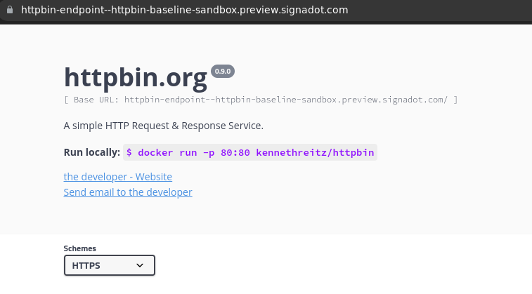
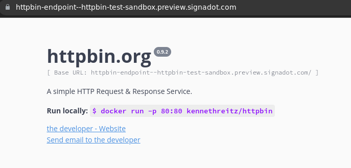

# Custom Routing With Envoy

This example explains how you can use Signadot for realizing custom routing using envoy.

## Set up

To set up the demo application, you can run the following in your cluster:

```
kubectl create ns httpbin
kubectl apply -f k8s/
```

This sets up [httpbin](https://httpbin.org/) in the cluster in the namespace
httpbin. The httpbin application listens on port 80 and has an envoy sidecar
that is running on port 8080 which is used for all communications in the
cluster. 

Once you have a signadot organization, connected a cluster and configured your
signadot CLI, you can create a sandbox as shown below by running:

```
signadot sandbox apply -f ./sandbox-baseline.yaml --set cluster=<your-cluster-name>
Created sandbox "httpbin-baseline-sandbox" (routing key: wtmb8kfswrrtb) in cluster "demo".

Waiting (up to --wait-timeout=3m0s) for sandbox to be ready...
✓ Sandbox status: Ready: All desired workloads are available.

Dashboard page: https://app.signadot.com/sandbox/id/wtmb8kfswrrtb

SANDBOX ENDPOINT   TYPE   URL
httpbin-endpoint   host   https://httpbin-endpoint--httpbin-baseline-sandbox.preview.signadot.com

The sandbox "httpbin-baseline-sandbox" was applied and is ready.
```

Once this is done, the above URL can be used to access the baseline instance.

This should look something like the following when you open it up in your
browser:



Note how it's running v0.9.0 of the application. This is the baseline version of
the application.

Now, we can create the second sandbox that is running a forked version of the
httpbin application by running the following:

```
signadot sandbox apply -f ./sandbox.yaml --set cluster=<your-cluster-name>
Created sandbox "httpbin-test-sandbox" (routing key: 0b5v8v6vvq954) in cluster "demo".

Waiting (up to --wait-timeout=3m0s) for sandbox to be ready...
✓ Sandbox status: Ready: All desired workloads are available.

Dashboard page: https://app.signadot.com/sandbox/id/0b5v8v6vvq954

SANDBOX ENDPOINT   TYPE   URL
httpbin-endpoint   host   https://httpbin-endpoint--httpbin-test-sandbox.preview.signadot.com

The sandbox "httpbin-test-sandbox" was applied and is ready.
```

The result of this URL should look something like this:



Note how it is running v0.9.2 of the application. This is the new version under
test that is being dynamically routed by envoy proxy by making use of the
context propagation header `baggage`.


## Routing Logic

See [k8s/envoy-config.yaml](k8s/envoy-config.yaml).

The routing logic on the envoy proxy makes use of a lua filter to process the
request, extract the routing-key, and then making a query to the `signadot`
operator's routeserver component to fetch any routing rules associated with that
particular routing-key. 

Once the destination is found, a header is added and re-routing is performed by
envoy's [Dynamic Forward Proxy](https://www.envoyproxy.io/docs/envoy/latest/intro/arch_overview/http/http_proxy) feature.


