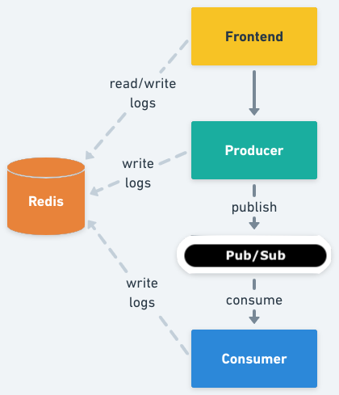

# PubSub Demo - Publish Messages On Demand

This is a sample application to demonstrate how Signadot sandboxes can be used
in the case of cloud-native applications with asynchronous architectures.

This application is formed by three microservices, the `frontend`, the
`publisher`, and the `subscriber`, one `Google Manage Pub/Sub Instance`, and one `Redis` server.

The `frontend` exposes an HTTP server from where static content (HTML, images)
can be accessed, and a minimal REST API with two different methods, one for
publishing a message, and another for getting log entries.

The `publisher` exposes a REST API with a single method that is called from the
frontend, every time a user submits a new message. Upon receiving a request it
publishes the message in `PubSub` with the provided information (by default in
the topic `pubsub-demo`).

The `subscriber` will perform a selective consumption of messages from `PubSub`.
Said selective consumption logic will use the [Signadot Routes
API](https://github.com/signadot/routesapi) (the REST version of it) to get the
required information to define if one message should be processed or not.

The three services from above implement context propagation via `OpenTelemetry`,
and upon receiving requests or consuming messages from `PubSub`, they log those
events in the `Redis` server.

Finally the `frontend` reads those logs and displays them on the UI (the browser
will pull the `frontend` API every two seconds).



## Running

First, install the provided manifests in the `k8s` directory

Go to `IAM & Admin` in the Google Cloud Console.

Create a new service account and grant the `Pub/Sub Admin` role.

Copy the service account email address.

Open `k8s/pubsub/pubsubsa.yaml` and set the `iam.gke.io/gcp-service-account` property with the service account email.

Apply the changes using

```sh
kubectl create ns pubsub-demo
kubectl apply -f k8s/pubsub/pubsubsa.yaml
```
Configure IAM Policy Binding

`Check IAM Admin Role:` Verify that the service account has been granted the IAM Admin role.

Bind Workload Identity:

```sh
gcloud iam service-accounts add-iam-policy-binding <service account email> \
    --member="serviceAccount:<project id>.svc.id.goog[pubsub-demo/pubsub-ksa]" \
    --role="roles/iam.workloadIdentityUser" \
    --project=<project id>
kubectl -n pubsub-demo apply -f k8s/pieces
```

Now, That needs to connect `[cluster]` with Signadot then create some sandboxes and route groups 
to perform some tests.
Go to `[Signadot Dashboard]` (https://app.signadot.com/).

Login to `[Signadot Dashboard]` then Navigate to cluster section and follow the instruction which is provided
it will connect with your k8's cluster

Then navigate to the `Sandboxes` section, copy and past configuration in the `signadot/sandboxes/subscriber.yaml` and `signadot/sandboxes/subscriber.yaml`.

Then navigate into the `Router Groups` section and add following infomation

Name: `pubsub-demo`

Description: `route group containing the subscriber and publisher sandboxes together`

Match:  

    label name: `demo`

    value: `pubsub`

Endpoints:  

    name: `frontend`

    protocol: `http`
    
    url: `frontend.pubsub-demo.svc:4000`

Check `K8's cluster` this will add additional two pods in the cluster 

Alternatively, you can install the [Signadot Browser
Extension](https://www.signadot.com/docs/browser-extensions) and create a
port-forward to the `frontend` service:

```sh
kubectl port-forward service/frontend -n pubsub-demo 4000:4000
```

Open a browser at http://localhost:4000/, and use the Signadot extension to set
your routing context.

To uninstall:

```sh
kubectl -n pubsub-demo delete -f k8s/pieces
```
