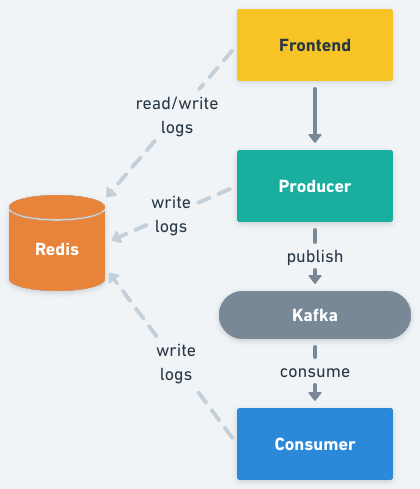

# Kafka Demo - Publish Messages On Demand

This is a sample application to demonstrate how Signadot sandboxes can be used
in the case of cloud-native applications with asynchronous architectures.

This application is formed by three microservices, the `frontend`, the
`producer`, and the `consumer`, one `Kafka` cluster, and one `Redis` server.

The `frontend` exposes an HTTP server from where static content (HTML, images)
can be accessed, and a minimal REST API with two different methods, one for
publishing a message, and another for getting log entries.

The `producer` exposes a REST API with a single method that is called from the
frontend, every time a user submits a new message. Upon receiving a request it
publishes the message in `Kafka` with the provided information (by default in
the topic `kafka-demo`).

The `consumer` will perform a selective consumption of messages from `Kafka`.
Said selective consumption logic will use the [Signadot Routes
API](https://github.com/signadot/routesapi) (the REST version of it) to get the
required information to define if one message should be processed or not.

The three services from above implement context propagation via `OpenTelemetry`,
and upon receiving requests or consuming messages from `Kafka`, they log those
events in the `Redis` server.

Finally the `frontend` reads those logs and displays them on the UI (the browser
will pull the `frontend` API every two seconds).




## Running

First, [install Signadot Operator](https://docs.signadot.com/docs/installation)
if you haven't already.

Second, install the provided manifests in the `k8s` directory

```sh
kubectl create ns kafka-demo
kubectl -n kafka-demo apply -f k8s/pieces
```

Now, create some sandboxes and route groups to perform some tests (replace
`[CLUSTER_NAME]` with your corresponding cluster name):

```sh
signadot sandbox apply -f ./signadot/sandboxes/producer.yaml --set cluster=[CLUSTER_NAME]
signadot sandbox apply -f ./signadot/sandboxes/consumer.yaml --set cluster=[CLUSTER_NAME]
signadot routegroup apply -f ./signadot/routegroups/demo.yaml --set cluster=[CLUSTER_NAME]
```

Once ready, you can test using the generated preview URLs from the above
commands, and/or by accessing the [Signadot
Dashboard](https://app.signadot.com/).


Alternatively, you can install the [Signadot Browser
Extension](https://www.signadot.com/docs/browser-extensions) and create a
port-forward to the `frontend` service:

```sh
kubectl port-forward service/frontend -n kafka-demo 4000:4000
```

Open a browser at http://localhost:4000/, and use the Signadot extension to set
your routing context.


To uninstall:

```sh
kubectl -n kafka-demo delete -f k8s/pieces
```
